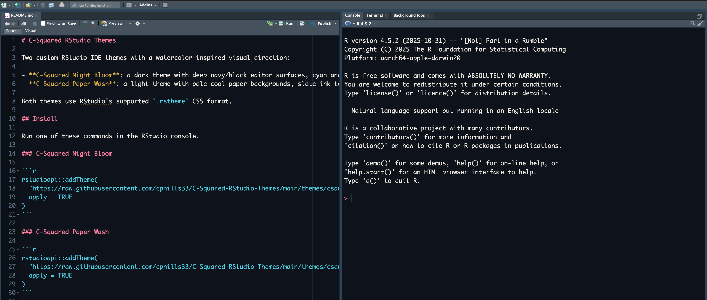
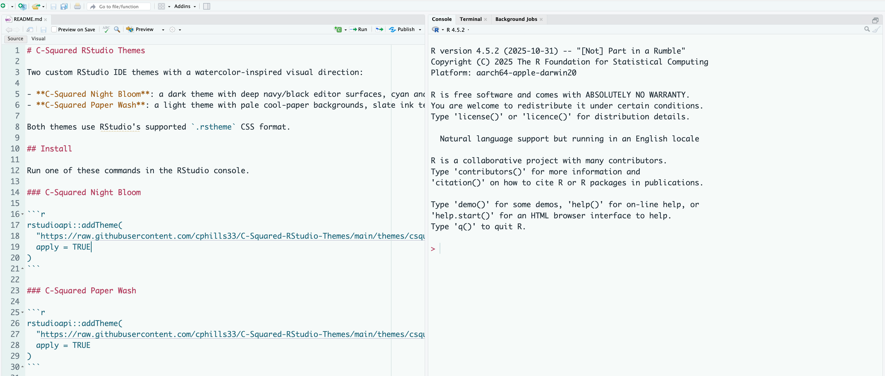

# C-Squared Themes

Three custom RStudio IDE themes, a Quarto RevealJS slide style, and ggplot2 helpers share a watercolor-inspired visual direction:

- **C-Squared Night Bloom**: a dark theme with deep navy/black editor surfaces, cyan and teal washes, rose/coral accents, muted gold, and leaf-green highlights.
- **C-Squared Paper Wash**: a light theme with pale cool-paper backgrounds, slate ink text, softened wash selections, and rose, teal, orange, violet, and leaf-green syntax accents.
- **C-Squared Blossom Ledger**: a light theme with warm paper backgrounds, slate-blue ink, dusty rose keywords, sea-glass teal utilities, and bark, gold, sage, and lavender secondary accents.

The RStudio themes use `.rstheme` files. The slide style and plot helpers are separate: a plot can use the palette without using the slide layout.

## Screenshots

### C-Squared Night Bloom



### C-Squared Paper Wash



## Install an RStudio theme

Run one of these commands in the RStudio console.

### C-Squared Night Bloom

```r
rstudioapi::addTheme(
  "https://raw.githubusercontent.com/cphills33/C-Squared-RStudio-Themes/main/themes/csquared-night-bloom.rstheme",
  apply = TRUE
)
```

### C-Squared Paper Wash

```r
rstudioapi::addTheme(
  "https://raw.githubusercontent.com/cphills33/C-Squared-RStudio-Themes/main/themes/csquared-paper-wash.rstheme",
  apply = TRUE
)
```

### C-Squared Blossom Ledger

```r
rstudioapi::addTheme(
  "https://raw.githubusercontent.com/cphills33/C-Squared-RStudio-Themes/main/themes/csquared-blossom-ledger.rstheme",
  apply = TRUE
)
```

You can also download a `.rstheme` file and add it manually from `Tools > Global Options > Appearance > Add`.

## Files

```text
screenshots/
  csquared-night-bloom.png
  csquared-paper-wash.png
themes/
  csquared-blossom-ledger.rstheme
  csquared-night-bloom.rstheme
  csquared-paper-wash.rstheme
slides/
  csquared-night-bloom.css
R/
  csquared-ggplot-theme.R
  csquared-slide-charts.R
examples/
  night-bloom-slides.qmd
```

## Quarto slides

For a RevealJS presentation, add the stylesheet to the document YAML:

```yaml
format:
  revealjs:
    theme: simple
    css: slides/csquared-night-bloom.css
    width: 1280
    height: 720
```

The CSS path is relative to your `.qmd` file. Copy the file into your project or adjust the path. See [the example presentation](examples/night-bloom-slides.qmd); from the repository root, render it with `quarto render examples/night-bloom-slides.qmd`.

## ggplot2 graphs

The general [ggplot2 helper](R/csquared-ggplot-theme.R) provides `theme_csquared()`, color scales, and palettes for all three styles. It needs `ggplot2`. The [slide chart helper](R/csquared-slide-charts.R) adds the dark chart treatment and highlighted horizontal bars from the presentation; it also needs `scales`.

```r
source("R/csquared-ggplot-theme.R")
source("R/csquared-slide-charts.R")

ggplot2::ggplot(my_data, ggplot2::aes(x, y, color = group)) +
  ggplot2::geom_point() +
  scale_color_csquared("night_bloom") +
  theme_csquared("night_bloom", transparent = FALSE)

csquared_highlight_bars(my_data, "group", "value", "North",
                        x_title = "Example value")
```

The second call expects `my_data` to have unique group labels and numeric values. Use `theme_csquared("paper_wash")` or `theme_csquared("blossom_ledger")` for light figures. These functions style graphs; they do not calculate or change the underlying results.

The slide stylesheet was adapted from the Project Implicit quiz presentation. The general graph helper originated in the separate C-Squared Quarto theme project. The example uses illustrative data only.

## Notes

If you edit a theme after installing it, restart RStudio if the changes do not appear immediately.

## License

This project is available under the MIT License. See [LICENSE](LICENSE) for details.
